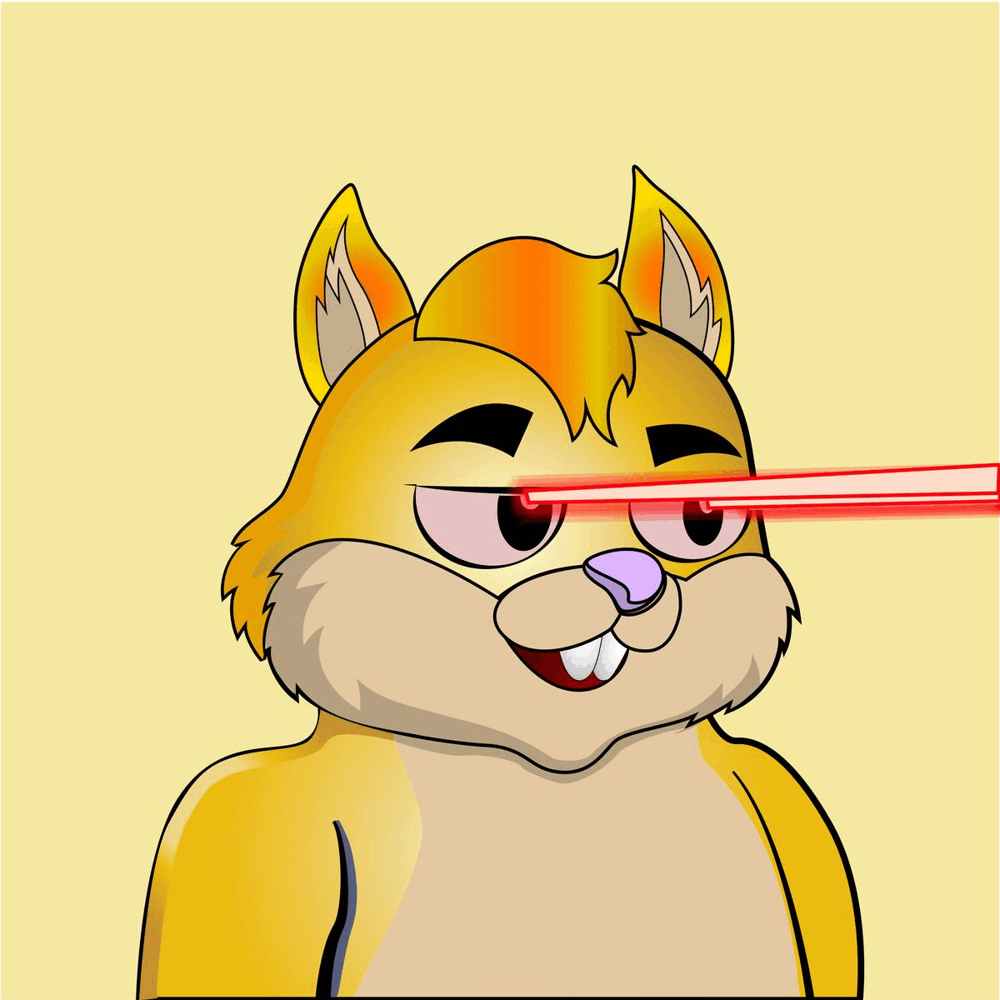

# Scrappy Squirrels

This repository contains the frontend code for the Scrappy Squirrels NFT project.

## About

Scrappy Squirrels is a collection of 10,000+ randomly generated NFTs. Scrappy Squirrels are meant for buyers, creators, and developers who are completely new to the NFT ecosystem.

The community is built around education, collaboration, and opportunity. Learn about web3, explore its current use cases, discover new applications, and find members to collaborate on exciting projects with.